<p align="center">
  
</p>

<p align="center">
  <a href="https://www.linkedin.com/in/daniel-stefan-reis/"></a>
  <a href="https://github.com/innexosistemas-lang/Offsec-labs"></a>
  
  
</p>

```console
analyst@soc-lab:~$ cat perfil.txt
  Papel     Estudante de Cibersegurança (PUC-Campinas) · Foco em Blue Team
  Alvo      NOC · Suporte N1/N2 · SOC N1
  Foco      Monitoramento · Redes TCP/IP · Logs · Triagem de alertas · Hardening
  Método    Detectar → Triar → Investigar → Responder → Documentar
  Lab       KVM (Kali · Win11 · Linux) + VPS Docker
  Objetivo  Estágio / júnior em NOC, Suporte de TI ou SOC — Campinas (presencial/híbrido)
```

### `> about`

Me chamo Daniel, sou estudante do bacharelado em **Cibersegurança** na PUC-Campinas e meu foco é **segurança defensiva**. Quero começar pela operação — **NOC e suporte** — monitorando disponibilidade, rede e chamados, e evoluir para **SOC**, analisando alertas, logs e incidentes.

Estudo redes, sistemas e segurança há mais de um ano e uso este GitHub como portfólio: tudo aqui foi montado, quebrado e documentado por mim, em ambiente próprio. Entender como um ataque funciona é o que me ajuda a detectar e prevenir melhor.

### `> o que eu faço`

```text
[NOC]     monitorar disponibilidade · ping/traceroute/DNS · diagnosticar link e serviço
[SUPORTE] atendimento N1/N2 · Windows/Linux · contas e permissões · registro de chamados
[SOC]     ler logs · triar alertas · analisar tráfego (Wireshark/tcpdump) · relatório de incidente
```

### `> toolkit`

**Sistemas & suporte**
<p>
  
  
  
  
  
</p>

**Redes & monitoramento**
<p>
  
  
  
  
  
</p>

**Segurança & análise**
<p>
  
  
  
  
  
</p>

**Automação & infra**
<p>
  
  
  
  
  
  
</p>

### `> featured lab`

<a href="https://github.com/innexosistemas-lang/Offsec-labs">
  
</a>

**Offsec-labs** — laboratório onde treino os dois lados: simulo o ataque e documento como **detectar, conter e corrigir**. Hardening de VPS, permissões e escalação de privilégios em Linux, análise de tráfego, relatório de incidente a partir de captura tcpdump e OWASP Top 10.

Todos os testes são feitos em **ambientes próprios ou expressamente autorizados**.

### `> roadmap`

```text
[x] Fundamentos de redes, Linux e Windows
[x] Lab de virtualização isolado (KVM)
[>] Google Cybersecurity Professional Certificate
[ ] SIEM na prática (Wazuh / Splunk) no lab
[ ] ISC2 CC  →  CompTIA Security+
```

### `> certifications`

```text
[x] Segurança em Linux na Era da IA ........... IBSEC · 2026
[~] Google Cybersecurity Professional Cert .... Coursera · em andamento
    ├─ [x] Technical Support Fundamentals
    ├─ [x] Foundations of Cybersecurity
    ├─ [x] Play It Safe: Manage Security Risks
    └─ [x] Connect and Protect: Networks and Network Security
```

---

<p align="center">
  <sub><code>// monitorar, detectar, responder, documentar.</code></sub>
</p>
